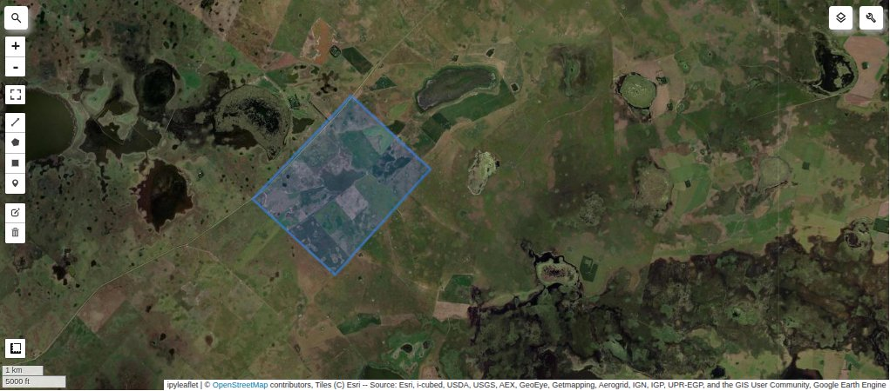
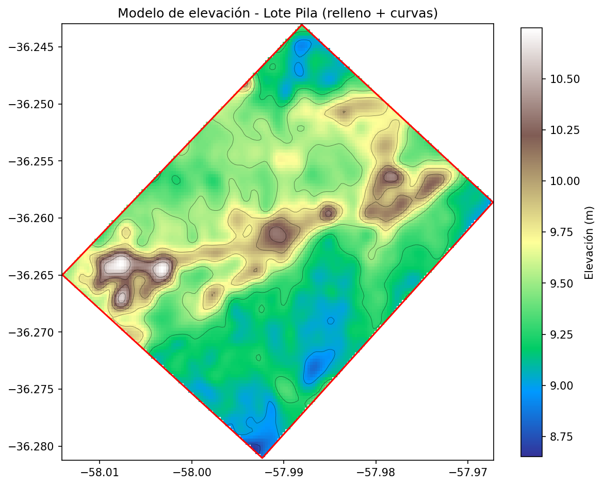
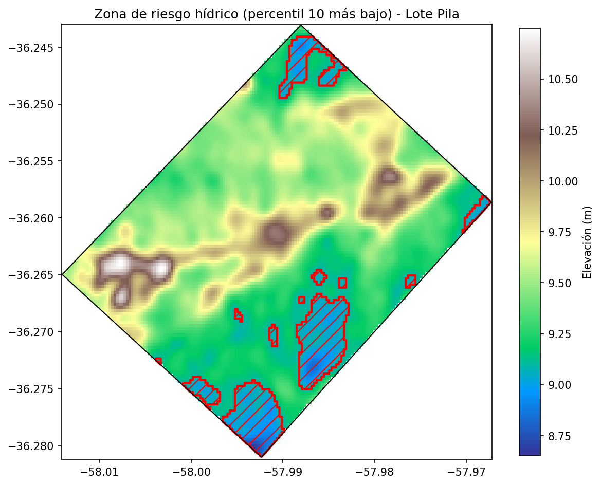
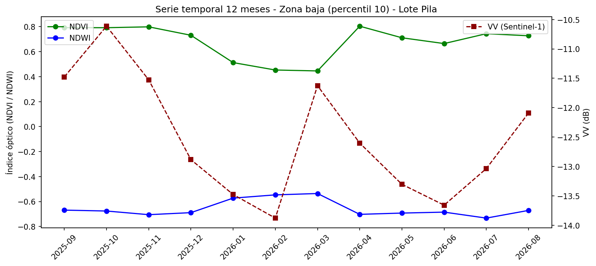
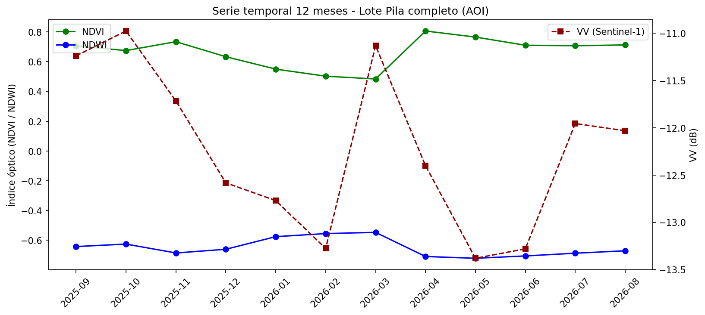

# Estudio Satelital para Alquiler de Campo — Lote Pila, Buenos Aires

**Mensura satelital y evaluación de riesgo hídrico de un establecimiento de 871,74 ha en el partido de Pila, Cuenca del Río Salado, Provincia de Buenos Aires.**

---

## 1. Ubicación y objeto del estudio

El lote analizado se ubica cerca de la localidad de Pila (Provincia de Buenos Aires), dentro de la Cuenca del Río Salado — una de las principales regiones ganaderas del país (aloja más del 20% del stock bovino nacional sobre pastizales naturales) y, a la vez, una de las más afectadas históricamente por anegamientos e inundaciones recurrentes.

El objetivo del estudio es el que un productor o inversor necesitaría, antes de decidir el alquiler de un campo, conocer con precisión la superficie y la infraestructura disponible, el relieve del terreno, y el riesgo hídrico real del lote — no solo el riesgo regional genérico de la zona.

| Dato | Valor |
|---|---|
| Superficie total | 871,74 ha |
| Coordenadas de referencia | -36,265676, -57,993135 |
| Partido | Pila, Buenos Aires |
| Cuenca | Río Salado |



*El polígono del lote (en azul) se digitalizó sobre imagen satelital de alta resolución. Se observan además lagunas y bañados naturales en el entorno inmediato, característicos del paisaje de la Cuenca del Salado.*

---

## 2. Mensura satelital

### 2.1 Planimetría

Se digitalizó la infraestructura visible sobre imagen satelital de alta resolución dentro del AOI:

| Elemento | Cantidad / Medida |
|---|---|
| Caminos internos y de acceso | 6.257 m |
| Silos bolsa y molinos (elementos puntuales) | 3 |

### 2.2 Altimetría

Se generó un modelo de elevación a partir del DEM Copernicus GLO-30, suavizado para reducir ruido de sensor en un terreno de relieve muy bajo, y se derivaron curvas de nivel con intervalo de 0,25 m.

- **Elevación mínima:** 8,65 m
- **Elevación máxima:** 10,75 m
- **Rango total:** 2,10 m

El lote muestra un relieve extremadamente chato, típico de la llanura deprimida de la Cuenca del Salado, con una cresta elevada que atraviesa el lote en diagonal (de oeste a noreste), formada por tres elevaciones menores conectadas entre sí. Las zonas más bajas se ubican por fuera de esa cresta, concentradas principalmente hacia el sector sur del lote y, en menor medida, en el extremo norte.



---

## 3. Riesgo hídrico

### 3.1 Contexto regional

La Cuenca del Río Salado atraviesa, desde comienzos de 2025 y hasta la fecha de este estudio, un período de excesos hídricos severos. Un análisis satelital de CARBAP (Confederación de Asociaciones Rurales de Buenos Aires y La Pampa) realizado entre el 11 y el 13 de noviembre de 2025 estimó cerca de 2.000.000 de hectáreas inundadas o anegadas en la cuenca, con otras 3.800.000 ha adicionales afectadas por falta de piso transitable. Hacia agosto-septiembre de 2026, informes oficiales y de productores de la misma cuenca seguían reportando suelos saturados y anegamientos activos, confirmando que la condición no fue un evento puntual sino un proceso prolongado.

### 3.2 Metodología

Se construyó una serie temporal mensual (septiembre 2025 - agosto 2026) combinando:

- **NDVI y NDWI** (Sentinel-2, óptico) — vigor vegetal y contenido de agua/vegetación.
- **VV** (Sentinel-1, radar de apertura sintética) — sensible a la rugosidad y humedad de la superficie, con la ventaja de no depender de nubosidad y de poder detectar saturación de suelo bajo cobertura vegetal, donde el óptico pierde sensibilidad.

El análisis se corrió primero sobre el AOI completo y no mostró señal clara de agua superficial ni correlación relevante entre el radar y los índices ópticos — resultado esperable en un lote de pastizal denso, donde el follaje enmascara el agua/humedad del suelo al sensor óptico.

Se repitió el análisis restringido al **10% de menor elevación del lote** (percentil 10 del DEM, ≤ 9,09 m), bajo la hipótesis de que el riesgo hídrico se concentra en las zonas bajas identificadas por la altimetría. Ahí sí emergió una señal clara y consistente entre ambos sensores.

### 3.3 Resultados

En la zona baja del lote, el backscatter VV cae de forma sostenida entre noviembre de 2025 y alcanza su mínimo en febrero de 2026, coincidiendo con el punto más bajo del NDVI en el mismo período (diciembre 2025 - marzo 2026) — un patrón consistente con estrés vegetativo por saturación de suelo, con recuperación posterior de ambos indicadores hacia mediados de 2026. La correlación NDVI-VV en esta zona fue de 0,43 (moderada), frente a un valor cercano a cero en el AOI completo.



*Zona con evidencia de estrés hídrico (percentil 10 de menor elevación), superpuesta al modelo de elevación. Se concentra principalmente en el sector sur del lote, con manchas menores en el borde norte.*



*Evolución mensual de NDVI, NDWI y VV en la zona baja. El descenso sostenido del VV hacia febrero 2026, en fase con el mínimo de NDVI, es la evidencia central del hallazgo.*

<details>
<summary>Ver serie temporal del AOI completo (referencia / contraste)</summary>



*Sobre el lote completo la señal se diluye: sin filtrar por elevación, no se observa relación clara entre el radar y los índices ópticos. Este contraste es el que justificó acotar el análisis a la zona baja.*

</details>

### 3.4 Superficie en riesgo

| | Superficie | % del lote |
|---|---|---|
| Con evidencia de riesgo hídrico | 86,50 ha | 9,9% |
| Sin restricciones aparentes | 785,24 ha | 90,1% |

---

## 4. Conclusión

El lote de Pila presenta un perfil de riesgo hídrico acotado y bien delimitado espacialmente: el 90,1% de la superficie (785,24 ha) no muestra evidencia de anegamiento ni estrés hídrico a lo largo del período analizado, a pesar de encontrarse en una cuenca con antecedentes severos de inundación regional. El 9,9% restante (86,50 ha), concentrado principalmente en el sector sur del lote, mostró un patrón de saturación temporal asociado al pico de la inundación regional 2025-2026, con recuperación posterior — compatible con manejo diferenciado (por ejemplo, destino ganadero o pastizal natural) antes que con exclusión total del uso productivo.

Esta combinación de mensura (superficie e infraestructura), altimetría (microrelieve) y riesgo hídrico validado con dos sensores independientes es la base de información con la que un productor o inversor podría tomar una decisión informada de alquiler, más allá de la percepción genérica de "zona de riesgo" que suele aplicarse a toda la Cuenca del Salado por igual.

---

## Fuentes de datos

- **Imágenes ópticas:** Copernicus Sentinel-2 SR Harmonized (ESA), vía Google Earth Engine.
- **Radar SAR:** Copernicus Sentinel-1 GRD (ESA), vía Google Earth Engine.
- **Modelo de elevación:** Copernicus DEM GLO-30 (ESA).
- **Contexto de inundación regional:** informes públicos de CARBAP (Confederación de Asociaciones Rurales de Buenos Aires y La Pampa) y cobertura periodística de la inundación de la Cuenca del Salado 2025-2026.

## Estructura del repositorio

```
scripts/    → procesamiento (mensura, altimetría, riesgo hídrico)
assets/     → imágenes finales del análisis
```

---

### Nota metodológica

El lote analizado fue elegido libremente con fines de práctica de portfolio y no corresponde a un cliente ni productor real. La relación entre el evento de inundación regional (documentado por fuentes públicas) y el comportamiento satelital del lote puntual es una inferencia por teledetección, no una validación de campo. El objetivo de este estudio es demostrar la metodología y el razonamiento de un servicio de consultoría geoespacial aplicado al agro, no ofrecer un diagnóstico certificable para uso comercial.

Sebastián Zárate — Agricultural Data Analyst
